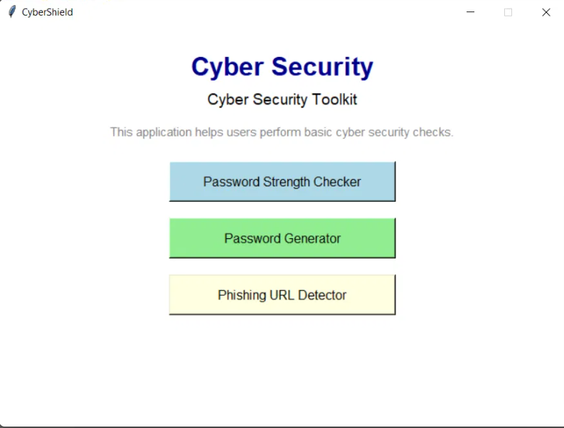
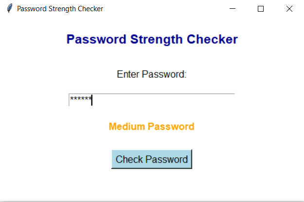
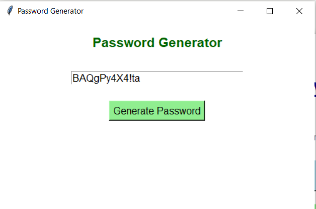
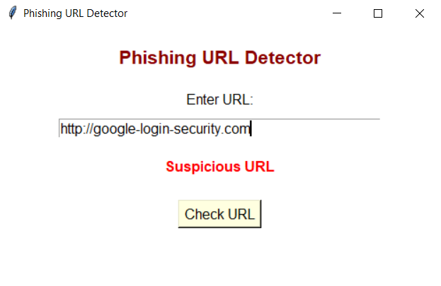

# cyber-security-mini-project
Python-based Cyber Security Toolkit — Password Checker, Generator &amp; Phishing URL Detector
# CyberShield - Cyber Security Toolkit

CyberShield is a Python-based Cyber Security Toolkit built with a simple Tkinter GUI. It was developed as a mini-project during a Cyber Security internship to apply core concepts like password security, phishing awareness, and cyber hygiene in a practical way. This is one of the easiest and fastest beginner-friendly projects to build — perfect for anyone starting out with Python and GUI development.

## Features

### Password Strength Checker
Evaluates the strength of a user-entered password based on its length and complexity, helping users create stronger passwords to improve account security.

### Password Generator
Generates strong, random passwords using a mix of uppercase letters, lowercase letters, numbers, and special characters.

### Phishing URL Detector
Performs a basic check on an entered URL to flag potentially suspicious or unsafe links.

## Tech Stack
- **Language:** Python
- **GUI Framework:** Tkinter
- **Libraries used:** `tkinter`, `random`, `string`

## How to Run
1. Make sure Python is installed on your system.
2. Clone this repository:git clone https://github.com/jiyagovrani-dev/cyber-security-mini-project.git
3. Navigate to the project folder and run:
## Screenshots

### Home Screen

### Password Strength Checker

### Password Generator

### Phishing URL Detector

## Learning Outcomes
- Gained hands-on understanding of core cybersecurity concepts and common cyber threats
- Learned to build GUI applications using Python's Tkinter library
- Practiced password security and basic phishing detection logic
- Improved debugging and application development skills

## Future Scope
- Add real-time website and email scanning
- Develop mobile/web versions for wider accessibility
- Add malware detection and file scanning features

## Author
**Jiya Govrani**
